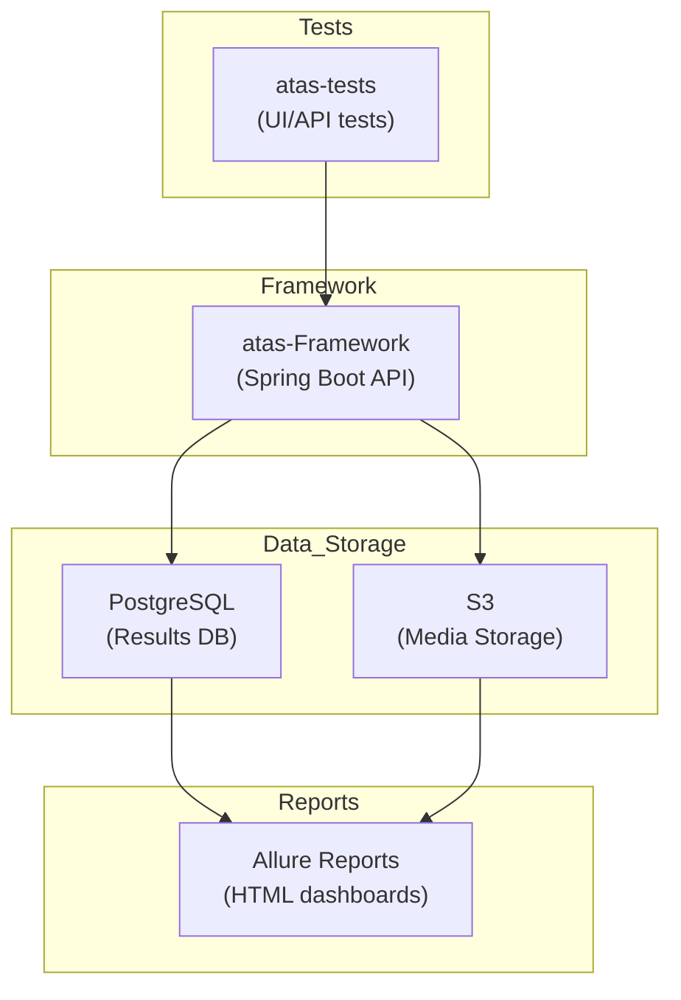

# 🚀 Advanced Testing As A Service (ATAS)

**ATAS** is an end-to-end **test automation platform** that brings together the power of  
**Spring Boot + Playwright + PostgreSQL + Allure** — all packaged as a cloud-ready service for running, monitoring, and reporting automated tests at scale.

[]()
[]()
[]()
[]()
[]()

---

## 🧭 Why ATAS?

Traditional frameworks are great for test execution, but they often lack:
- **Central orchestration** — no unified way to manage, monitor, and report across environments.  
- **Standardised governance** — inconsistent policy enforcement between UI/API/mobile tests.  
- **Ease of sharing** — test insights are trapped in CI logs, not accessible via APIs or dashboards.

**ATAS** fills that gap — it’s a **Testing-as-a-Service** platform that you can deploy, extend, and integrate with your DevOps pipelines.

---

## ⚙️ Quick Start

```bash
git clone https://github.com/<your-username>/atas-monorepo.git
cd atas-monorepo
./mvnw clean package -DskipTests
docker-compose -f docker/docker-compose.yml up --build
````

This launches:

* 🗄  **PostgreSQL** on port 5432
* 🧠  **ATAS Framework Service** on port 8080
* 🧩  Auto-migrated schema (via Flyway)
* ☁️  Optional video uploads to Amazon S3

Open [http://localhost:8080](http://localhost:8080) to confirm it’s alive.

---

## 🧩 Setup Guide

### 1️⃣ Prerequisites

Make sure your system has:

* **Linux / macOS / WSL2**
* **Git**
* **Docker & Docker Compose**
* **Java 21 (LTS)** and **Maven 3.9+**

Install Java 21 easily using **SDKMAN!**:

```bash
# Install SDKMAN (once)
curl -s "https://get.sdkman.io" | bash
source "$HOME/.sdkman/bin/sdkman-init.sh"

# Install Java 21 (Temurin build)
sdk install java 21.0.4-tem
sdk default java 21.0.4-tem

# Install Maven
sdk install maven
mvn -v
java -version
```

This sets up a clean, reproducible JDK + Maven environment.

---

### 2️⃣ Clone and Build

```bash
git clone https://github.com/<your-username>/atas-monorepo.git
cd atas-monorepo

# Use Maven Wrapper (no local Maven needed)
./mvnw clean package -DskipTests
```

This downloads all dependencies and compiles both modules.

If you want to warm up Maven for offline use:

```bash
./mvnw dependency:go-offline
```

---

### 3️⃣ Run the Framework Locally (without Docker)

```bash
cd atas-framework
./mvnw spring-boot:run
```

Access the service at [http://localhost:8080](http://localhost:8080).
The application will auto-create its schema in PostgreSQL (if configured) and expose REST APIs.

---

### 4️⃣ Database Configuration

Edit `atas-framework/src/main/resources/application.yml`:

```yaml
spring:
  datasource:
    url: jdbc:postgresql://localhost:5432/atas
    username: atas_user
    password: secret
  jpa:
    hibernate:
      ddl-auto: update
```

Run PostgreSQL locally if you don’t already have it:

```bash
docker run -d --name postgres -e POSTGRES_PASSWORD=secret -p 5432:5432 postgres:16
```

---

### 5️⃣ Run the Tests Module

```bash
cd ../atas-tests
./mvnw test
```

Allure reports are generated at:

```
atas-tests/target/site/allure-maven-plugin/index.html
```

To open the report interactively:

```bash
./mvnw allure:serve
```

---

### 6️⃣ Run Everything with Docker (Recommended)

```bash
docker-compose -f docker/docker-compose.yml up --build
```

This spins up:

* PostgreSQL → 5432
* ATAS Framework → 8080
* Optional Allure container for visual reports

Stop services with `Ctrl + C` or `docker-compose down`.

---

### 7️⃣ Troubleshooting

| Problem                         | Fix                                                                 |
| ------------------------------- | ------------------------------------------------------------------- |
| `mvnw: Permission denied`       | `chmod +x mvnw`                                                     |
| `Port 8080 already in use`      | Change `server.port` in `application.yml`                           |
| `Chrome not found (Playwright)` | Run any test once — Playwright downloads its browsers automatically |
| Slow build                      | Add `-T 1C` for parallel Maven build                                |
| `connection refused` to DB      | Ensure PostgreSQL is running and credentials match                  |

---

## 🧱 Monorepo Layout

```
atas-monorepo/
├── pom.xml              → parent POM
├── atas-framework/      → Spring Boot core service
├── atas-tests/          → Example tests & Page Objects
├── docker/              → Dockerfile & Compose setup
├── scripts/             → build, run, and report helpers
└── README.md
```

---

## 🧩 Core Modules

### **1. atas-framework**

Runs as a Spring Boot application exposing REST APIs to orchestrate and record executions.

* Spring Data JPA for persistence
* Playwright for Java as the automation driver
* Flyway migrations for DB lifecycle
* SSE for live monitoring of test progress
* AWS S3 integration for screenshots/videos
* Allure integration for unified reports

### **2. atas-tests**

Showcases how to implement tests on top of the framework using **Page Object Model** and **fluent chaining**.

```java
@Test
void login_should_succeed() {
    Page page = playwrightService.createPage(CHROMIUM);
    LoginPage login = new LoginPage(page);
    login.enterUsername("admin")
         .enterPassword("password")
         .submit()
         .verifyLoggedIn();
}
```

Run them with:

```bash
./scripts/run-tests.sh
./scripts/generate-reports.sh
```

Open the generated report at
`atas-tests/target/site/allure-maven-plugin/index.html`.

---

## 🕹 Monitoring API

Once the ATAS service is running:

| Purpose            | Endpoint                                             |
| ------------------ | ---------------------------------------------------- |
| Poll status        | `GET /api/v1/test-execution/status?executionId={id}` |
| Live updates (SSE) | `GET /api/v1/test-execution/live?executionId={id}`   |
| Retrieve results   | `GET /api/v1/test-execution/results/{id}`            |

---

## 🧩 Extending ATAS

| Feature                      | How                                                                 |
| ---------------------------- | ------------------------------------------------------------------- |
| **New browsers**             | Extend `BrowserType` enum and enhance `PlaywrightDriverFactory`     |
| **Custom storage**           | Implement `StorageService` and register via Spring                  |
| **New metrics / dashboards** | Create new JPA entities or REST endpoints                           |
| **CI/CD integration**        | Use Docker Compose in your pipeline for ephemeral test environments |

---

## 🌐 Architecture Overview



---

## 🤝 Contributing

We welcome improvements!

* Fork the repo
* Create a feature branch
* Run `./mvnw verify` before submitting PRs
* Add yourself to `CONTRIBUTORS.md` ❤️

---

## 🌍 Roadmap

* [ ] Support for **mobile automation** via Appium adapter
* [ ] **Multi-tenant mode** for parallel projects
* [ ] Integration with **Grafana/Prometheus** for execution metrics
* [ ] **OpenAPI spec** for the REST layer

---

## 🪪 License

This project is licensed under the MIT License - see the [LICENSE](LICENSE) file for details.

The MIT License allows you to:
- ✅ Use the software for any purpose
- ✅ Modify and distribute the software
- ✅ Use it in commercial projects
- ✅ Distribute modified versions

The only requirement is that you include the original copyright notice and license text.

---

> *“Testing as a Service is not just about running tests — it’s about building a living ecosystem that learns, records, and reports with precision.”*