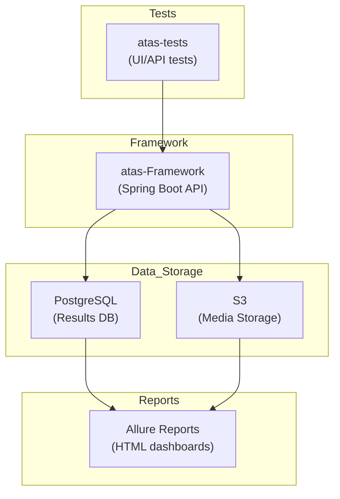

# 🚀 Advanced Testing As A Service (ATAS)

**ATAS** is an end-to-end **test automation platform** that brings together the power of  
**Spring Boot + Playwright + PostgreSQL + Allure** — all packaged as a cloud-ready service for running, monitoring, and reporting automated tests at scale.

[]()
[]()
[]()
[]()
[]()

---

## 🧭 Why ATAS?

Traditional frameworks are great for test execution, but they often lack:
- **Central orchestration** — no unified way to manage, monitor, and report across environments.  
- **Standardised governance** — inconsistent policy enforcement between UI/API/mobile tests.  
- **Ease of sharing** — test insights are trapped in CI logs, not accessible via APIs or dashboards.

**ATAS** fills that gap — it’s a **Testing-as-a-Service** platform that you can deploy, extend, and integrate with your DevOps pipelines.

---

## ⚙️ Quick Start

Get ATAS up and running in 3 simple commands:

```bash
git clone https://github.com/<your-username>/atas-monorepo.git
cd atas-monorepo
make setup    # Initial setup & dependency installation
make dev      # Start development environment
```

This automatically:
* ✅ Checks all prerequisites
* 📦 Installs dependencies
* 🏗️ Builds the project
* 🐳 Starts Docker services (PostgreSQL + ATAS Framework)
* 🧩 Auto-migrates database schema
* 🌍 Uses environment-agnostic configuration (dev profile by default)

**Services will be available at:**
* 🧠 **ATAS Framework**: [http://localhost:8080](http://localhost:8080)
* 🗄️ **PostgreSQL**: localhost:5433
* 📊 **Health Check**: [http://localhost:8080/actuator/health](http://localhost:8080/actuator/health)

**New to ATAS?** For detailed step-by-step onboarding, see the [Getting Started Guide](docs/GETTING_STARTED.md).

**Need help?** Run `make help` to see all available commands.

---

## 🌍 Environment Configuration

ATAS is fully environment-agnostic and supports multiple deployment environments:

### **Environment Profiles**
- **`dev`** - Development environment (default)
- **`stage`** - Staging environment  
- **`prod`** - Production environment

### **Quick Environment Setup**

**Development (default):**
```bash
make dev  # Uses dev profile automatically
```

**Staging:**
```bash
make dev-stage
# or
SPRING_PROFILES_ACTIVE=stage make dev
```

**Production:**
```bash
make dev-prod
# or
SPRING_PROFILES_ACTIVE=prod make dev
```

### **Environment Variables**

| Variable | Description | Default |
|----------|-------------|---------|
| `SPRING_PROFILES_ACTIVE` | Active Spring profile | `dev` |
| `DB_URL` | Database connection URL | Auto-detected based on environment (see below) |
| `DB_USERNAME` | Database username | `atas` |
| `DB_PASSWORD` | Database password | `ataspass` |
| `S3_BUCKET` | S3 bucket for media storage | `atas-videos` |
| `S3_REGION` | AWS region | `us-east-1` |

### **Smart Database Connection Detection**

ATAS automatically detects and connects to the correct database based on your active environment:

**Detection Priority:**
1. **Explicit Configuration** (highest priority)
   - `DB_URL` environment variable
   - `spring.datasource.url` system property
2. **Environment-Aware Detection** (automatic fallback)
   - Checks `SPRING_PROFILES_ACTIVE` to determine intended environment
   - Detects running Docker containers (`atas-db` for dev/stage, `atas-db-prod` for prod)
   - Verifies port availability (5433 for local Docker Compose, 5432 for standard PostgreSQL)

**How It Works:**

- **`make dev`** → Detects `dev` profile → Connects to `localhost:5433` (local Docker Compose)
- **`make dev-stage`** → Detects `stage` profile → Connects to `localhost:5433` (local Docker Compose)
- **`make dev-prod`** → Detects `prod` profile → Warns if production DB not accessible from host

**Note:** Production Docker containers don't expose database port to host for security. Use `make dev` for local testing, or set `DB_URL` explicitly for custom configurations.

### **Configuration Files**
- `atas-framework/src/main/resources/application-dev.yml` - Development settings
- `atas-framework/src/main/resources/application-stage.yml` - Staging settings  
- `atas-framework/src/main/resources/application-prod.yml` - Production settings
- `atas-tests/src/test/resources/application-dev.yml` - Test development settings
- `atas-tests/src/test/resources/application-stage.yml` - Test staging settings
- `atas-tests/src/test/resources/application-prod.yml` - Test production settings

---

## 🧩 Setup Guide

### 1️⃣ Prerequisites

Make sure your system has the following dependencies:

#### System Dependencies
* **Make** - Build automation tool (usually pre-installed on Linux/macOS)
* **Git** - Version control system
* **Docker & Docker Compose** - Containerization platform
* **Java 21 (LTS)** and **Maven 3.9+** - Java runtime and build tool

#### Installing System Dependencies

**For Ubuntu/Debian:**
```bash
sudo apt update
sudo apt install make git docker.io docker-compose-plugin
```

**For macOS (with Homebrew):**
```bash
brew install make git docker docker-compose
```

**For Windows (WSL2):**
```bash
# In WSL2 terminal
sudo apt update
sudo apt install make git docker.io docker-compose-plugin
```

#### Installing Java 21 with SDKMAN! (Recommended)

```bash
# Install SDKMAN (once)
curl -s "https://get.sdkman.io" | bash
source "$HOME/.sdkman/bin/sdkman-init.sh"

# Install Java 21 (Temurin build)
sdk install java 21.0.4-tem
sdk default java 21.0.4-tem

# Install Maven
sdk install maven
mvn -v
java -version
```

This sets up a clean, reproducible JDK + Maven environment.

---

### 2️⃣ Project Setup

```bash
git clone https://github.com/<your-username>/atas-monorepo.git
cd atas-monorepo
make setup    # Complete setup in one command
```

The `make setup` command automatically:
* ✅ Verifies all prerequisites are installed
* 🔧 Configures the project (Maven wrapper permissions, git config)
* 📦 Downloads and installs all dependencies
* 🏗️ Builds the project

---

### 3️⃣ Development Workflow

**Start development environment:**
```bash
make dev      # Start all services with Docker
```

**Run tests:**
```bash
make test              # Run all tests
make test-unit         # Run unit tests only (fastest)
make test-integration  # Run integration tests only
make test-ui           # Run UI tests only
make test-api          # Run API tests only
make test-by-type      # Run all test types in sequence
```

**Generate reports:**
```bash
make report        # Generate Allure reports
make report-serve  # Serve reports locally
```

**Development commands:**
```bash
make build    # Build the project (compile)
make compile  # Compile the project (alias for build)
make install  # Install artifacts to local Maven repository
make clean    # Clean build artifacts
make logs     # View service logs
make stop     # Stop all services
```

---

### 4️⃣ Alternative: Run Without Docker

If you prefer to run the framework locally without Docker:

```bash
make run      # Run ATAS framework locally
```

**Note:** You'll need to configure PostgreSQL separately. The system will auto-detect the database, or you can set environment variables:

```bash
export DB_URL="jdbc:postgresql://localhost:5432/atasdb"
export DB_USERNAME="atas"
export DB_PASSWORD="ataspass"
export SPRING_PROFILES_ACTIVE="dev"
```

**Database Connection:** If `DB_URL` is not set, the system will automatically detect:
- Local Docker Compose database on port 5433 (when `make dev` is used)
- Standard PostgreSQL on port 5432 (if running locally)
- Based on `SPRING_PROFILES_ACTIVE` and running Docker containers

---

## 🛠️ Makefile Commands Reference

ATAS includes a comprehensive Makefile with 30+ commands to simplify development workflows. All commands are self-documenting - run `make help` to see the complete list.

### 📋 Essential Commands

| Command | Description |
|---------|-------------|
| `make help` | Show all available commands with descriptions |
| `make setup` | Complete project setup (prerequisites check, build, config) |
| `make dev` | Start development environment (Docker services) |
| `make test` | Run all tests |
| `make build` | Build the project (compiles source code) |
| `make compile` | Compile the project (alias for build) |
| `make install` | Install project artifacts to local Maven repository |
| `make clean` | Clean build artifacts |

### 🧪 Testing Commands

| Command | Description |
|---------|-------------|
| `make test` | Run all tests |
| `make test-unit` | Run unit tests only (fastest, H2-based) |
| `make test-integration` | Run integration tests only (PostgreSQL with Testcontainers) |
| `make test-by-type` | Run all test types in sequence (unit, integration) |
| `make test-ui` | Run UI tests only |
| `make test-api` | Run API tests only |
| `make test-suite SUITE=authentication-ui` | Run specific test suite |
| `make test-with-service` | Run tests with framework service running |
| `make quick-test` | Quick test (alias for test-unit) |

### 🏗️ Building Commands

| Command | Description |
|---------|-------------|
| `make build` | Build the project (compiles source code) |
| `make compile` | Compile the project (alias for build) |
| `make package` | Package the project (create JARs) |
| `make install` | Install project artifacts to local Maven repository |

### 🐳 Docker & Services

| Command | Description |
|---------|-------------|
| `make docker-up` | Start Docker services |
| `make docker-down` | Stop Docker services |
| `make docker-logs` | Show Docker service logs |
| `make docker-restart` | Restart Docker services |
| `make docker-build` | Build Docker images |

### 📊 Reporting & Quality

| Command | Description |
|---------|-------------|
| `make report` | Generate test reports |
| `make report-serve` | Serve test reports locally |
| `make lint` | Run code quality checks |
| `make format` | Format code |
| `make security` | Run security checks |
| `make check-all` | Run all checks (build, test, lint, security) |

### 🔧 Development

| Command | Description |
|---------|-------------|
| `make run` | Run framework locally (without Docker) |
| `make logs` | Show application logs |
| `make stop` | Stop all services |
| `make deps` | Show dependency tree |
| `make deps-update` | Update dependencies |
| `make info` | Show project information |

### 🌿 Git & Workflow

| Command | Description |
|---------|-------------|
| `make commit MESSAGE="feat: add feature"` | Commit with message |
| `make push` | Push changes to remote |
| `make pull` | Pull latest changes |
| `make status` | Show git status |
| `make branch NAME=feature/new` | Create new branch |
| `make release VERSION=1.0.0` | Create a release |

### 🧹 Cleanup

| Command | Description |
|---------|-------------|
| `make clean` | Clean build artifacts |
| `make clean-all` | Clean everything (build, Docker, logs) |

### 🚀 CI/CD

| Command | Description |
|---------|-------------|
| `make ci` | Run CI pipeline locally |
| `make pr-check` | Run PR checks locally |
| `make deploy` | Deploy to staging |

---

### 5️⃣ Troubleshooting

| Problem                         | Fix                                                                 |
| ------------------------------- | ------------------------------------------------------------------- |
| `make: command not found`       | Install Make: `sudo apt install make` (Ubuntu) or `brew install make` (macOS) |
| `mvnw: Permission denied`       | Run `make setup` or `chmod +x mvnw`                                |
| `Port 8080 already in use`      | Change `server.port` in `application.yml` or run `make stop` first |
| `Chrome not found (Playwright)` | Run `make test` once — Playwright downloads browsers automatically |
| `Docker not running`            | Start Docker service: `sudo systemctl start docker` (Linux)        |
| `connection refused` to DB      | Run `make docker-up` to start PostgreSQL service                   |
| Slow build                      | Use `make build-fast` for faster builds                            |
| Tests failing with connection errors | Run `make test-with-service` instead of `make test`               |
| Integration tests failing       | Run `make docker-up` first, then `make test-integration`           |
| Need fastest test feedback      | Use `make test-unit` for H2-based unit tests                       |
| Docker build issues             | Rebuild with `make docker-build` or reset with `make stop && docker system prune -f` |
| PostgreSQL version conflicts    | Ensure all tests use PostgreSQL 18 (check docker-compose and test files) |
| Database connection wrong environment | System auto-detects based on `SPRING_PROFILES_ACTIVE` and Docker containers. Set `DB_URL` explicitly to override |
| Production DB not accessible | Production containers don't expose DB port. Use `make dev` for local testing or set `DB_URL` to a different database |

---

## 🧱 Monorepo Layout

```
atas-monorepo/
├── pom.xml              → parent POM
├── atas-framework/      → Spring Boot core service
├── atas-tests/          → Example tests & Page Objects
├── docker/              → Dockerfile & Compose setup
├── scripts/             → build, run, and report helpers
└── README.md
```

---

## 🧪 Test Types & Execution

ATAS supports multiple test types optimized for different scenarios:

### **Unit Tests** (`make test-unit`)
- **Fastest execution** - Uses H2 in-memory database
- **No external dependencies** - Perfect for rapid feedback during development
- **Framework tests only** - Tests the core ATAS framework functionality
- **Pattern**: `*Test` (excludes `*IT`)

### **Integration Tests** (`make test-integration`)
- **PostgreSQL with Testcontainers** - Real database testing
- **Framework integration** - Tests framework components with real database
- **Pattern**: `*IT` (Integration Test)
- **Requires**: PostgreSQL container running


### **Test Execution Examples**

```bash
# Quick development feedback (fastest)
make test-unit

# Test with real database (integration)
make test-integration

# Run all test types in sequence
make test-by-type

# Traditional test categories
make test-ui    # UI tests only
make test-api   # API tests only
make test       # All tests
```

---

## 🧩 Core Modules

### **1. atas-framework**

Runs as a Spring Boot application exposing REST APIs to orchestrate and record executions.

* Spring Data JPA for persistence
* Playwright for Java as the automation driver
* Flyway migrations for DB lifecycle
* SSE for live monitoring of test progress
* AWS S3 integration for screenshots/videos
* Allure integration for unified reports
* **Test Execution API** - Trigger tests by individual test, tags, grep patterns, or suites
* **Test Discovery API** - Discover available tests, suites, and tags dynamically
* **Asynchronous Execution** - Non-blocking test execution with real-time monitoring

### **2. atas-tests**

Showcases how to implement tests on top of the framework using **Page Object Model** and **fluent chaining**. The test layer is organized by product with feature-based test organization.

**Test Organization:**
- **Product-based structure**: `products/automationexercise/` - Tests organized by product
- **Feature-based organization**: Tests grouped by features (UI/API separation)
- **Page Objects**: Centralized page object model in `pages/` directory
- **Shared utilities**: Common test utilities, hooks, and configuration

**Test Configuration:**
- `TestConfiguration` - Centralized test configuration with Testcontainers
- `TestTags` - Standardized test tags for categorization and filtering
- `ApiTestHooks` / `UiTestHooks` - Test lifecycle management hooks

```java
@Test
@Tag(TestTags.UI)
@Tag(TestTags.SMOKE)
void login_should_succeed() {
    Page page = playwrightService.createPage(CHROMIUM);
    LoginPage login = new LoginPage(page);
    login.enterUsername("admin")
         .enterPassword("password")
         .submit()
         .verifyLoggedIn();
}
```

Run them with:

```bash
make test              # Run all tests
make test-unit         # Run unit tests only (fastest)
make test-integration  # Run integration tests only
make test-ui           # Run UI tests only
make test-api          # Run API tests only
make test-by-type      # Run all test types in sequence
make report            # Generate Allure reports
make report-serve      # Serve reports locally
```

Reports are automatically generated at:
`atas-tests/target/site/allure-maven-plugin/index.html`

---

## 📚 Documentation

Comprehensive documentation is available in the [`docs/`](docs/) directory:

- **[🚀 Getting Started](docs/GETTING_STARTED.md)** - Step-by-step onboarding guide for new contributors
- **[📖 Documentation Index](docs/README.md)** - Overview of all available documentation
- **[🔧 API Reference](docs/API_REFERENCE.md)** - Complete REST API documentation with endpoints, parameters, and examples
- **[🧪 Test Execution Guide](docs/TEST_EXECUTION_GUIDE.md)** - Step-by-step guide for executing and monitoring tests
- **[🌍 Environment Configuration](docs/ENVIRONMENT_CONFIGURATION.md)** - Complete guide for environment-agnostic configuration

### Quick API Examples

```bash
# Discover available tests
curl -s "http://localhost:8080/api/v1/tests/discover" | jq .

# Execute tests by tags
curl -s -X POST "http://localhost:8080/api/v1/tests/execute/tags?tags=smoke" | jq .

# Monitor execution
curl -s "http://localhost:8080/api/v1/test-execution/status?executionId=<executionId>" | jq .
```

---

## 🕹 Test Execution & Monitoring API

The ATAS framework provides comprehensive REST APIs for test discovery, execution, and monitoring. For complete API documentation, see the [API Reference](docs/API_REFERENCE.md).

### 🚀 Key Features

- **Test Discovery** - Dynamically discover available tests, suites, and tags
- **Multiple Execution Types** - Individual tests, tag-based, pattern-based, and suite execution
- **Real-time Monitoring** - Live updates via Server-Sent Events (SSE)
- **Asynchronous Execution** - Non-blocking test execution with status tracking
- **Flexible Configuration** - Environment, browser, timeout, and recording options

### 📝 Quick Examples

**Discover available tests:**
```bash
curl -s "http://localhost:8080/api/v1/tests/discover" | jq .
```

**Execute tests by tags:**
```bash
curl -s -X POST "http://localhost:8080/api/v1/tests/execute/tags?tags=smoke,api" | jq .
```

**Execute individual test:**
```bash
curl -s -X POST "http://localhost:8080/api/v1/tests/execute/individual?testClass=LoginApiTest&testMethod=login_api_should_return_token" | jq .
```

**Monitor execution:**
```bash
curl -s "http://localhost:8080/api/v1/test-execution/status?executionId=<executionId>" | jq .
```

For detailed API documentation with all endpoints, parameters, and examples, see the [API Reference](docs/API_REFERENCE.md).

---

## 🧩 Extending ATAS

| Feature                      | How                                                                 |
| ---------------------------- | ------------------------------------------------------------------- |
| **New browsers**             | Extend `BrowserType` enum and enhance `PlaywrightDriverFactory`     |
| **Custom storage**           | Implement `StorageService` and register via Spring                  |
| **New metrics / dashboards** | Create new JPA entities or REST endpoints                           |
| **CI/CD integration**        | Use Docker Compose in your pipeline for ephemeral test environments |
| **Custom test execution**    | Extend `TestExecutionService` and add new execution types           |
| **Test discovery**           | Implement custom test discovery logic in `TestDiscoveryService`     |

---

## 🌐 Architecture Overview



---

## 🤝 Contributing

We welcome improvements! Please follow the guidelines below for contributing to ATAS.

### Quick Start for Contributors

1. **Fork the repository**
2. **Complete onboarding** - Follow the [Getting Started Guide](docs/GETTING_STARTED.md) for detailed step-by-step instructions
3. **Setup and build**:
   ```bash
   make setup    # Complete setup (prerequisites, dependencies, build)
   ```
4. **Create a feature branch**:
   ```bash
   make branch NAME=feature/your-feature-name
   ```
5. **Start development**:
   ```bash
   make dev      # Start development environment
   ```
6. **Follow commit guidelines** (see below)
7. **Run tests** before submitting:
   ```bash
   make pr-check # Run all PR checks locally (build, test, lint, security)
   ```
8. **Submit a pull request** with a clear description of your changes

### Development Workflow

```bash
make help              # Show all available commands
make dev               # Start development environment
make test              # Run all tests
make test-unit         # Run unit tests only (fastest)
make test-integration  # Run integration tests only
make test-ui           # Run UI tests only
make test-api          # Run API tests only
make test-by-type      # Run all test types in sequence
make build             # Build project (compile)
make compile           # Compile project (alias for build)
make install           # Install artifacts to local Maven repository
make lint              # Run code quality checks
make report            # Generate test reports
make clean             # Clean build artifacts
make ci                # Run CI pipeline locally
```

### Commit Message Format

We follow [Conventional Commits](https://www.conventionalcommits.org/):

```bash
feat(auth): add OAuth2 login support
fix(ui): resolve login button click issue
docs(api): update test execution endpoint documentation
```

### Commit Message Guidelines

We follow [Conventional Commits](https://www.conventionalcommits.org/) for consistent commit messages:

- `feat:` - New features
- `fix:` - Bug fixes
- `docs:` - Documentation changes
- `style:` - Code style changes (formatting, etc.)
- `refactor:` - Code refactoring
- `test:` - Adding or updating tests
- `chore:` - Maintenance tasks

**Examples:**
- `feat(api): add test execution by tags endpoint`
- `fix(ui): resolve login button click issue`
- `docs(readme): update API documentation`

---

## 🌍 Roadmap

* [ ] Support for **mobile automation** via Appium adapter
* [ ] **Multi-tenant mode** for parallel projects
* [ ] Integration with **Grafana/Prometheus** for execution metrics
* [ ] **OpenAPI spec** for the REST layer

---

## 🪪 License

This project is licensed under the MIT License - see the [LICENSE](LICENSE) file for details.

The MIT License allows you to:
- ✅ Use the software for any purpose
- ✅ Modify and distribute the software
- ✅ Use it in commercial projects
- ✅ Distribute modified versions

The only requirement is that you include the original copyright notice and license text.

---

> *“Testing as a Service is not just about running tests — it’s about building a living ecosystem that learns, records, and reports with precision.”*