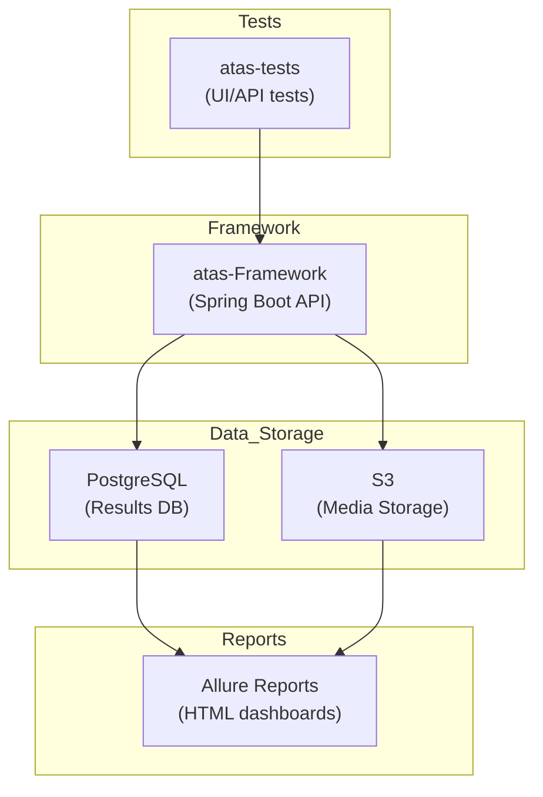

# 🚀 Advanced Testing As A Service (ATAS)

**ATAS** is a cloud-ready test automation platform that combines **Spring Boot + Playwright + PostgreSQL + Allure** for running, monitoring, and reporting automated tests at scale.

[]()
[]()
[]()
[]()
[]()

## 🎯 What is ATAS?

A unified **Testing-as-a-Service** platform with:
- **Central orchestration** - REST APIs for test discovery, execution, and monitoring
- **Real-time monitoring** - Server-Sent Events for live test progress
- **Comprehensive reporting** - Allure reports with video/screenshot attachments
- **Environment-agnostic** - Support for dev/stage/prod environments
- **Multi-test support** - UI tests (Playwright) and API tests in one platform

## ⚡ Quick Start

```bash
git clone https://github.com/<your-username>/atas-monorepo.git
cd atas-monorepo
make setup    # Initial setup
make dev      # Start development environment
```

**Available Services:**
- 🧠 **ATAS Framework**: http://localhost:8080
- 📈 **Monitoring Dashboard**: http://localhost:8080/monitoring/dashboard
- 🗄️ **Database Dashboard**: http://localhost:8080/monitoring/database
- 📊 **Health Check**: http://localhost:8080/actuator/health
- 🐘 **PostgreSQL**: localhost:5433

**Prerequisites:** Java 21+, Maven 3.9+, Docker & Docker Compose  
See [Getting Started Guide](docs/GETTING_STARTED.md) for detailed setup.

## 🛠️ Essential Commands

### Setup & Development
```bash
make setup       # Complete project setup
make dev          # Start development environment
make build        # Build the project
make run          # Run framework locally (without Docker)
```

### Testing
```bash
make test              # Run all tests
make test-unit         # Fast unit tests (H2 in-memory)
make test-integration  # Integration tests (PostgreSQL)
make test-ui           # UI tests (Playwright)
make test-api          # API tests
```

### Docker & Reporting
```bash
make docker-up      # Start Docker services
make docker-down    # Stop Docker services
make report         # Generate Allure reports
make report-serve   # Serve reports locally
```

Run `make help` for the complete command list.

## 🏗️ Architecture



## 🧩 Core Modules

**`atas-framework`** - Spring Boot service providing REST APIs for:
- Test discovery, execution (individual/tags/patterns/suites)
- Real-time monitoring with SSE-based live updates
- Result persistence with PostgreSQL storage and S3 media attachments

**`atas-tests`** - Test implementations with:
- Page Object Model with fluent chaining
- Product-based organization (e.g., `products/automationexercise/`)
- Feature-based structure (UI/API separation)

## 🌐 API Quick Reference

```bash
# Discover tests
curl -s "http://localhost:8080/api/v1/tests/discover" | jq .

# Execute tests by tags
curl -s -X POST "http://localhost:8080/api/v1/tests/execute/tags?tags=smoke" | jq .

# Monitor execution
curl -s "http://localhost:8080/api/v1/test-execution/status?executionId=<id>" | jq .

# Dashboard overview
curl -s "http://localhost:8080/api/v1/test-execution/dashboard/overview" | jq .

# Database health
curl -s "http://localhost:8080/api/v1/database/health" | jq .
```

See [API Reference](docs/API_REFERENCE.md) for complete documentation.

## 📊 Monitoring & Dashboards

### Test Monitoring Dashboard
**URL:** http://localhost:8080/monitoring/dashboard

- **Overview Metrics** - Total executions, tests, success rate, average execution time
- **Active Executions** - Real-time updates via Server-Sent Events
- **Recent Executions** - Latest test execution history
- **Execution Trends** - Visual charts showing patterns over time
- **Test Distribution** - Breakdown by status (passed, failed, skipped)
- **Database Health & Operations** - Connection status, pool metrics, CRUD tracking
- **Auto-refresh** - Configurable intervals (5s to 10 minutes)

### Database Management Dashboard
**URL:** http://localhost:8080/monitoring/database

- **Database Health** - Connection status, pool status, database info
- **Real-time Operations** - Live tracking of INSERT, UPDATE, DELETE, SELECT
- **Database Statistics** - Table sizes, row counts, performance metrics
- **Table Browsing** - Browse executions, results, steps, attachments, metrics
- **Query Performance** - Recent query metrics and timing
- **Connection Pool** - Active/idle connections and utilization

## 🌍 Environment Configuration

```bash
make dev         # Development (default)
make dev-stage    # Staging
make dev-prod    # Production
# Or explicitly: SPRING_PROFILES_ACTIVE=stage make dev
```

See [Environment Configuration](docs/ENVIRONMENT_CONFIGURATION.md) for details.

## 📚 Documentation

- **[Getting Started](docs/GETTING_STARTED.md)** - Step-by-step onboarding
- **[API Reference](docs/API_REFERENCE.md)** - Complete REST API documentation
- **[Test Execution Guide](docs/TEST_EXECUTION_GUIDE.md)** - Test execution workflows
- **[Environment Configuration](docs/ENVIRONMENT_CONFIGURATION.md)** - Environment setup

## 🤝 Contributing

1. Fork the repository
2. Complete setup: `make setup`
3. Create feature branch: `make branch NAME=feature/your-feature`
4. Run tests: `make test`
5. Submit a pull request

See [CONTRIBUTING.md](CONTRIBUTING.md) for detailed guidelines.

## 📄 License

MIT License - see the [LICENSE](LICENSE) file for details.

---

**Happy Testing! 🧪**
